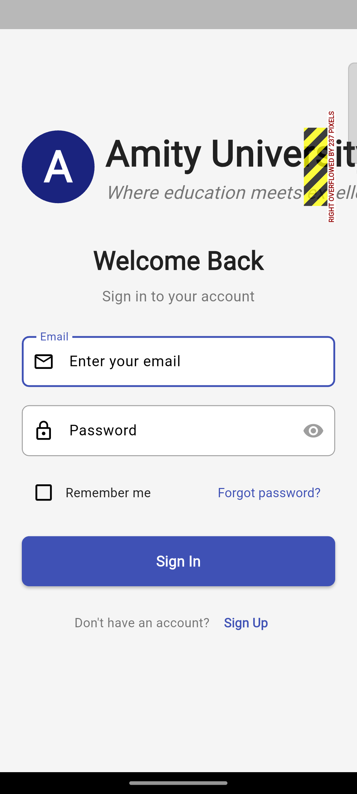

<div align="center">

# 🎓 Flutter University Student Portal

### A production-style Flutter web application built with Dart, Firebase Authentication & Cloud Firestore

[](https://flutter.dev)
[](https://dart.dev)
[](https://firebase.google.com)
[](LICENSE)

**Developed by [Prajwal M P](https://github.com/Prajwal-031)**
Final-year B.Tech CSE · Amity University Bengaluru

[🎥 Live Demo](https://drive.google.com/file/d/1pdWaLsIzQ_6jeURcr_LG9ExzIrVb4Rbr/view?usp=sharing) · [🐛 Report Bug](https://github.com/Prajwal-031/flutter-firebase-university-student-portal/issues) · [💡 Request Feature](https://github.com/Prajwal-031/flutter-firebase-university-student-portal/issues)

</div>

---

## 📸 Screenshots

<div align="center">
  
  &nbsp;&nbsp;
  
  <p><em>Login Screen &nbsp;&nbsp;&nbsp;&nbsp;&nbsp;&nbsp;&nbsp;&nbsp;&nbsp;&nbsp;&nbsp;&nbsp;&nbsp;&nbsp;&nbsp;&nbsp;&nbsp;&nbsp;&nbsp;&nbsp;&nbsp;&nbsp;&nbsp;&nbsp;&nbsp;&nbsp;&nbsp;&nbsp;&nbsp;&nbsp;&nbsp;&nbsp;&nbsp;&nbsp;&nbsp;&nbsp;&nbsp;&nbsp;&nbsp;&nbsp;&nbsp;&nbsp;&nbsp;&nbsp;&nbsp;&nbsp;&nbsp;&nbsp;&nbsp;&nbsp;&nbsp;&nbsp; University Dashboard</em></p>
</div>

---

## 🚀 About The Project

This is a **cross-platform Flutter web application** built as an independent project inspired by Amity University Bengaluru's student management needs. It demonstrates a complete, production-style architecture using Flutter + Firebase — covering authentication flows, real-time Firestore operations, responsive UI, and service-based code organisation.

The project is structured with clean separation between services, screens, and widgets — making it maintainable, testable, and easy to extend.

---

## ✨ Features

### 🔐 Authentication System
- Email/password login with form validation and error handling
- New user registration with password strength indicator
- Forgot password flow via Firebase email link
- "Remember me" session persistence
- Secure authentication state management across screens

### 🏠 University Dashboard
- Personalised welcome greeting with user display name
- University branding, quick-access cards, and announcements section
- Responsive layout that adapts across web screen sizes

### 🗂️ Navigation
- Side navigation drawer with categorised menu items
- Top navigation bar with notification icon
- Breadcrumb-style navigation for deep screens
- Accessible user profile section

### ☁️ Firebase Backend
- **Firebase Authentication** — email/password auth, password reset, session handling
- **Cloud Firestore** — user profile storage, real-time data sync
- Secure authentication flow with error feedback
- Service-based architecture for clean Firebase abstraction

---

## 🛠️ Tech Stack

| Layer | Technology |
|---|---|
| UI Framework | Flutter (Dart) |
| Authentication | Firebase Authentication |
| Database | Cloud Firestore |
| UI Design | Material Design 3 |
| Platform | Flutter Web (also supports Android, iOS, Linux, macOS, Windows) |
| Architecture | Service-based (auth service, Firestore service) |

---

## 📁 Project Structure

```
lib/
├── main.dart                  # App entry point & Firebase init
├── services/
│   ├── auth_service.dart      # Firebase Auth abstraction
│   └── firestore_service.dart # Firestore CRUD operations
├── screens/
│   ├── login_screen.dart      # Login UI + form validation
│   ├── register_screen.dart   # Registration flow
│   ├── forgot_password.dart   # Password reset screen
│   └── dashboard_screen.dart  # Main university dashboard
├── widgets/
│   ├── nav_drawer.dart        # Side navigation drawer
│   ├── top_nav_bar.dart       # App bar with notifications
│   └── quick_access_card.dart # Reusable dashboard card
└── utils/
    ├── validators.dart        # Form validation helpers
    └── constants.dart         # App-wide constants
```

---

## ⚡ Getting Started

### Prerequisites

- Flutter SDK `3.x` or above — [install guide](https://flutter.dev/docs/get-started/install)
- A Firebase project with Authentication and Firestore enabled
- Chrome browser (for web development)

### Installation

```bash
# 1. Clone the repository
git clone https://github.com/Prajwal-031/flutter-firebase-university-student-portal.git

# 2. Navigate into the project
cd flutter-firebase-university-student-portal

# 3. Install dependencies
flutter pub get

# 4. Configure Firebase
# Add your google-services.json (Android) or GoogleService-Info.plist (iOS)
# For web, update lib/firebase_options.dart with your Firebase config

# 5. Run on Chrome
flutter run -d chrome
```

### Firebase Setup

1. Go to [Firebase Console](https://console.firebase.google.com) → Create project
2. Enable **Authentication** → Email/Password provider
3. Enable **Cloud Firestore** → Start in test mode
4. Copy your web config and paste into `lib/firebase_options.dart`

---

## 🗺️ Roadmap

- [x] Email/password authentication
- [x] User registration & profile management
- [x] Forgot password flow
- [x] Responsive university dashboard
- [x] Cloud Firestore integration
- [ ] Google / Social login (OAuth)
- [ ] Dark mode theme toggle
- [ ] Push notifications (Firebase Cloud Messaging)
- [ ] Student course management module
- [ ] Academic calendar with event tracking
- [ ] File upload (assignments, documents)

---

## 🤝 Contributing

Contributions are welcome. If you find a bug or want to add a feature:

1. Fork the repository
2. Create your feature branch — `git checkout -b feature/your-feature`
3. Commit your changes — `git commit -m 'Add your feature'`
4. Push to the branch — `git push origin feature/your-feature`
5. Open a Pull Request

---

## 👨‍💻 Author

**Prajwal M P**
Final-year B.Tech CSE · Amity University Bengaluru

[](https://linkedin.com/in/prajwal-mp-848680332)
[](https://github.com/Prajwal-031)
[](https://leetcode.com/u/mpprajwal)
[](mailto:mpprajwal11@gmail.com)

---

## 📜 License

Distributed under the MIT License. See [`LICENSE`](LICENSE) for details.

---

## 🙏 Acknowledgements

- [Flutter](https://flutter.dev) — for the outstanding cross-platform framework
- [Firebase](https://firebase.google.com) — for backend-as-a-service
- [Material Design](https://material.io) — for UI component guidelines
- Amity University Bengaluru — inspiration for the portal concept

---

<div align="center">

⭐ **If this project helped you, drop a star — it helps others find it!** ⭐

</div>
